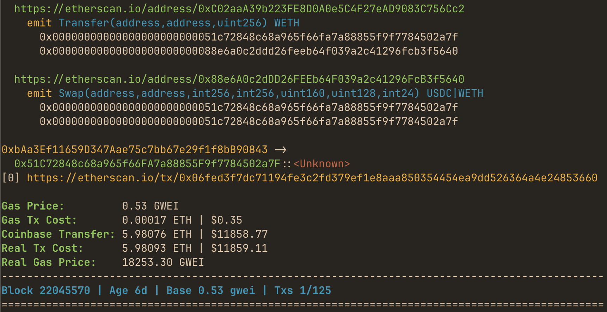

## mevlog-rs - explore EVM chains from your terminal 
[](https://crates.io/crates/mevlog) [](https://github.com/pawurb/mevlog-rs/actions)
 


Rust-based CLI tool for querying Ethereum (or any EVM-compatible chain) transactions, with flexible filtering and EVM tracing capabilities. 

When working on an MEV bot, I could not find a simple way to search for specific transactions. I wrote one-off query scripts, and wanted to generalize them in an easy to reuse tool. So I started building `mevlog` to work as an _"SQL for blockchain"_. 

`mevlog` allows you to find and analyze transaction details via a simple CLI interface. It currently offers the following features:

- regexp search by emitted event names  
- search by ENS domain names
- filter txs based on their position in a block
- search by root and internal method calls
- track smart contract storage changes
- detect validator bribes
- filter by the amount of a specific ERC20 token sent
- filter txs by value and real (including bribe) gas prices and cost
- colored human-readable, and JSON output formats
- [ChainList](https://chainlist.org/) integration to automatically select RPC endpoints

It works on public RPCs thanks to leveraging EVM tracing via [Revm](https://github.com/bluealloy/revm).

You can [check out this article](https://pawelurbanek.com/long-tail-mev-revm) for technical details on how this project is implemented.

There's also [a beta web version](https://mevlog.rs/) available.

## Getting started

> **⚠️ Note**  
> This README reflects the latest development on the `main` branch.
> For documentation matching the current release, see [crates.io](https://crates.io/crates/mevlog) — it stays in sync with the published crate.

Mevlog uses [cryo CLI](https://github.com/paradigmxyz/cryo) for fetching data. Please install it first by running:

```bash
cargo install cryo_cli
```

and then:

```bash
git clone https://github.com/pawurb/mevlog-rs
cd mevlog-rs
cargo install --path .
```

or install from the [crates.io](https://crates.io/crates/mevlog):

```bash
cargo install mevlog
mevlog watch --rpc-url https://eth.merkle.io 
```

### Connection options

You can connect to chains using either a direct RPC URL or by specifying a chain ID:

**Using RPC URL:**
```bash
mevlog watch --rpc-url https://eth.merkle.io
```

**Using Chain ID:**
```bash
mevlog watch --chain-id 1        # Ethereum mainnet  
mevlog watch --chain-id 137      # Polygon
mevlog watch --chain-id 56       # BSC
```

When using `--chain-id`, mevlog automatically fetches available RPC URLs from [ChainList](https://chainlist.org/), benchmarks them, and selects the fastest responding endpoint. Please remember that `--trace rpc` will likely not work with public RPC endpoints. And `--trace revm` could be throttled.

To discover available chain IDs, use the `chains` command:
```bash
mevlog chains --filter arbitrum  # Find Arbitrum-related chains
mevlog chains --filter base      # Find Base-related chains
mevlog chains --chain-id 1 --chain-id 137  # Show specific chains by ID
mevlog chains --limit 10         # Show only first 10 chains
```

On initial run `mevlog` downloads ~80mb [openchain.xyz signatures](https://openchain.xyz/signatures), and [ChainList data](https://chainlist.org/) database to `~/.mevlog`. Signatures data allows displaying human readable info instead of hex blobs.

To avoid throttling on public endpoints `watch` mode displays only the top 5 transactions from each block.

You can change it using the `--position` argument:

```bash
## display the top 20 txs from each new block
mevlog watch -p 0:19 
```

## Filtering options

Here's a complete list of currently supported filters:

```
Options:
      --limit <LIMIT>
          Limit the number of transactions returned
      --sort <SORT>
          Sort transactions by field (gas-price, gas-used, tx-cost, full-tx-cost)
      --sort-dir <SORT_DIR>
          Sort direction (desc, asc) [default: desc]
  -f, --from <FROM>
          Filter by tx source address or ENS name
      --to <TO>
          Filter by tx target address or ENS name, or CREATE transactions
  -t, --touching <TOUCHING>
          Filter by contracts with storage changed by the transaction
      --rpc-url <RPC_URL>
          The URL of the HTTP provider [env: ETH_RPC_URL]
      --chain-id <CHAIN_ID>
          Chain ID to automatically select best RPC URL
      --event <EVENT>
          Include txs by event names matching the provided regex or signature and optionally an address
      --not-event <NOT_EVENT>
          Exclude txs by event names matching the provided regex or signature and optionally an address
      --method <METHOD>
          Include txs with root method names matching the provided regex, signature or signature hash
      --calls <CALLS>
          Include txs by subcalls method names matching the provided regex, signature or signature hash
      --show-calls
          Show detailed tx calls info
      --tx-cost <TX_COST>
          Filter by tx cost (e.g., 'le0.001ether', 'ge0.01ether')
      --real-tx-cost <REAL_TX_COST>
          Filter by real (including coinbase bribe) tx cost (e.g., 'le0.001ether', 'ge0.01ether')
      --gas-price <GAS_PRICE>
          Filter by effective gas price (e.g., 'ge2gwei', 'le1gwei')
      --real-gas-price <REAL_GAS_PRICE>
          Filter by real (including coinbase bribe) effective gas price (e.g., 'ge3gwei', 'le2gwei')
      --value <VALUE>
          Filter by transaction value (e.g., 'ge1ether', 'le0.1ether')
      --erc20-transfer <TRANSFER>
          Filter by Transfer events with specific address and optionally amount (e.g., '0xa0b86991c6218b36c1d19d4a2e9eb0ce3606eb48' or '0xa0b86991c6218b36c1d19d4a2e9eb0ce3606eb48|ge1000gwei')
      --erc20-transfer-amount
          Display transfer amounts in ERC20 Transfer event logs
      --ens
          Enable ENS name resolution for addresses (increases RPC calls)
      --erc20-symbols
          Enable ERC20 token symbol resolution (increases RPC calls)
      --failed 
          Show only txs which failed to execute
      --format <FORMAT>
          Output format ('text', 'json', 'json-pretty', 'json-stream', 'json-pretty-stream')
```

Both `search` and `watch` support the same filtering options.

A few examples of currently supported queries:

- find `jaredfromsubway.eth` transactions from the last 20 blocks that landed in positions 0-5:

```bash
mevlog search -b 10:latest -p 0:5 --from jaredfromsubway.eth --chain-id 1 
```

- unknown method signature contract call in a top position (likely an MEV bot):

```bash
mevlog search -b --method "<Unknown>" -p 0 --chain-id 1
```

- query the last 50 blocks for transaction that transferred [PEPE](https://etherscan.io/token/0x6982508145454ce325ddbe47a25d4ec3d2311933) token:

```bash
mevlog search -b 50:latest --event "Transfer(address,address,uint256)|0x6982508145454ce325ddbe47a25d4ec3d2311933" --chain-id 1
```

- blocks between 22034300 and 22034320, position 0 transaction that did not emit any `Swap` events:

```bash
mevlog search -b 22034300:22034320 -p 0 --not-event "/(Swap).+/"
```

- blocks range for events containing `rebase` and `Transfer` keywords:

```bash
mevlog search -b 22045400:22045420 --event "/(?i)(rebase).+/" --event "/(Transfer).+/"
```

- query by transactions that created a new smart contract:

```bash
mevlog search -b 22045400:22045420 --to CREATE
```

- find transactions that transferred more than 1 ETH:

```bash
mevlog search -b 10:latest --value ge1ether
```

- find transactions that transferred over 100k USDC

```bash
mevlog search -b 10:latest --erc20-transfer "0xa0b86991c6218b36c1d19d4a2e9eb0ce3606eb48|ge100gwei"
```

- find transactions that emitted any Transfer events for USDC and display amounts:

```bash
mevlog search -b 10:latest --erc20-transfer "0xa0b86991c6218b36c1d19d4a2e9eb0ce3606eb48" --erc20-transfer-amount
```

- find the top 10 transactions from the last 20 blocks sorted by gas price:

```bash
mevlog search -b 20:latest --sort gas-price --limit 10
```

- find the 5 most expensive transactions by total cost from recent blocks:

```bash
mevlog search -b 10:latest --sort full-tx-cost --limit 5 --trace rpc
```

- find the 10 cheapest transactions by gas price (ascending order):

```bash
mevlog search -b 10:latest --sort gas-price --sort-dir asc --limit 10
```

### Event filters

The `--event` and `--not-event` options allow filtering transactions based on emitted events. The filter criteria can be:

- a contract address matching on any emitted events `0x6982508145454ce325ddbe47a25d4ec3d2311933`
- a full event signature `Transfer(address,uint256)`
- a regular expression pattern `/(?i)(rebase).+/`
- a combination of an event signature and a contract address `Transfer(address,uint256)|0x6982508145454ce325ddbe47a25d4ec3d2311933`

You can supply mutiple `--event` and `--not-event` flags for precise control over which transactions are included or excluded.

### Transfer filters

The `--erc20-transfer` option allows filtering transactions that emitted ERC20 Transfer events. The filter criteria can be:

- a contract address matching any transfer amount: `0xa0b86a33e6ba3bc6c2c5ed1b4b29b5473fd5d2de`
- a contract address with amount filtering: `0xa0b86a33e6ba3bc6c2c5ed1b4b29b5473fd5d2de|ge1000` (transfers >= 1000 tokens)
- amount operators: `ge` (greater or equal), `le` (less or equal)
- amount units: raw numbers, `ether`, `gwei`, etc.

You can supply multiple `--erc20-transfer` flags to match transfers from different tokens or with different amount criteria.

By default, transfer amounts are not displayed in the logs. Use the `--erc20-transfer-amount` flag to show transfer amounts alongside the Transfer events.

### ENS and ERC20 token symbols resolution

You can enable ENS name resolution and ERC20 token symbol lookup for transfers and Uniswap swaps using the `--ens` and `--erc20-symbols` flags:

```bash
# Enable ENS name display for addresses
mevlog search -b 10:latest --ens --chain-id 1

# Enable ERC20 token symbols display 
mevlog search -b 10:latest --erc20-symbols --chain-id 1

# Enable both ENS and token symbols
mevlog search -b 10:latest --ens --erc20-symbols --chain-id 1
```

**Performance considerations:**

⚠️ **Warning**: Enabling these flags increases RPC calls and may cause throttling on public endpoints.

**Recommended usage pattern:**
1. **Initial cache population**: Enable flags for a small range of recent blocks to cache popular ENS names and ERC20 symbols:

```bash
# Cache popular symbols and ENS names from recent blocks
mevlog search -b 10:latest --ens --erc20-symbols --chain-id 1
```

2. **Regular usage**: Disable flags to use only cached values, reducing RPC calls:

```bash
# Use cached ENS/symbol data only (no additional RPC calls)
mevlog search -b 100:latest --chain-id 1
```

The tool maintains persistent caches in `~/.mevlog/.ens-cache` and `~/.mevlog/.symbols-cache`. Once populated, cached values are used automatically even when the flags are disabled.

### EVM tracing filters

All the above queries use only standard block and logs input. By enabling `--trace [rpc|revm]` flag you can query by more conditions:

- query last 5 blocks for a top transaction that paid over 0.02 ETH total (including coinbase bribe) transaction cost:

```bash
mevlog search -b 5:latest -p 0 --real-tx-cost ge0.02ether --trace revm
```

- find txs that changed storage slots of the [Balancer vault contract](https://etherscan.io/address/0xba12222222228d8ba445958a75a0704d566bf2c8):

`mevlog search -b 10:latest --touching 0xba12222222228d8ba445958a75a0704d566bf2c8 --trace rpc`

You can also filter by real (including bribe) gas price:

```bash
mevlog search -b 5:latest -p 0:5 --real-gas-price ge10gwei --trace rpc
```

It's possible to search txs by their sub method calls:

```bash
mevlog search -b 5:latest -p 0:5 --calls "/(swap).+/" --trace rpc
```


## Output formats

Mevlog supports different output formats via the `--format` option:

- `text` (default): Human-readable colored output, displays results block by block as they are processed
- `json`: Compact, oneline JSON output, displays all results at once after processing all blocks
- `json-pretty`: Pretty-printed JSON output, displays all results at once after processing all blocks  
- `json-stream`: Compact, oneline JSON output, displays results block by block as they are processed
- `json-pretty-stream`: Pretty-printed JSON output, displays results block by block as they are processed

**Streaming vs Batch behavior:**
- **Streaming formats** (`text`, `json-stream`, `json-pretty-stream`): Display results block by block as they are processed, useful for real-time monitoring and large block ranges
- **Batch formats** (`json`, `json-pretty`): Collect all results in memory and display them at once after processing all blocks, useful for piping to other tools or when you need all results in a single JSON array

Examples:
```bash
# Default human-readable output (streaming)
mevlog search -b 10:latest --format default

# Compact JSON, all results at once
mevlog search -b 10:latest --format json

# Pretty JSON, streaming block by block
mevlog search -b 10:latest --format json-pretty-stream
```

## EVM tracing modes

### `--trace rpc` 

This mode uses the `debug_traceTransaction` method. It's usually not available on public endpoints.

### `--trace revm` 

This mode leverages Revm tracing by downloading all the relevant storage slots and running simulations locally. If you want to trace a transaction at position 10, Revm must first simulate all the previous transactions from this block. It can be slow and cause throttling from public endpoints. 

Subsequent `revm` simulations for the same block and transaction range use cached data and should be significantly faster.

## Analyzing a single transaction data

```bash
mevlog tx 0x06fed3f7dc71194fe3c2fd379ef1e8aaa850354454ea9dd526364a4e24853660 --chain-id 1
```

This command displays info for a single target transaction. By adding `--before` `--after` arguments you can include surrounding transactions:

```bash
mevlog tx 0x06fed3f7dc71194fe3c2fd379ef1e8aaa850354454ea9dd526364a4e24853660 -b 1 -a 1 --chain-id 1
```

You can reverse the display order by adding the `--reverse` flag.

## Listing available chains

```bash
mevlog chains                          # List all available chains
mevlog chains --filter ethereum        # Filter chains containing "ethereum" 
mevlog chains --filter polygon         # Filter chains containing "polygon"
mevlog chains --chain-id 1 --chain-id 137  # Show specific chains by ID
mevlog chains --limit 5                # Show only first 5 chains
mevlog chains --format json            # Output as JSON
mevlog chains --format json-pretty     # Output as pretty JSON
```

Sample text output:
```text
Available chains (7 total):
#    Chain ID Name
------------------------------------------------------------
1    1        Ethereum Mainnet
2    61       Ethereum Classic
3    1617     Ethereum Inscription Mainnet
4    52226    Cytonic Ethereum Testnet
5    513100   EthereumFair
6    560048   Ethereum Hoodi
7    11155111 Ethereum Sepolia
```

Sample JSON output:
```json
[
  {
    "chain_id": 1,
    "name": "Ethereum Mainnet",
    "chain": "ETH"
  },
  {
    "chain_id": 137,
    "name": "Polygon Mainnet",
    "chain": "Polygon"
  }
]
```

**Options:**
- `--filter <TEXT>`: Filter chains by name (case-insensitive substring match)
- `--chain-id <ID>`: Filter by specific chain IDs (can be used multiple times)
- `--limit <NUMBER>`: Limit the number of chains returned
- `--format <FORMAT>`: Output format ('text', 'json', 'json-pretty')

## Getting chain information

```bash
mevlog chain-info --chain-id 1    # Ethereum mainnet
mevlog chain-info --chain-id 56   # BSC mainnet  
mevlog chain-info --chain-id 137  # Polygon mainnet
```

Sample output:

```text
Chain Information
================
Chain ID: 1
Name: Ethereum Mainnet
Currency: ETH
Explorer URL: https://etherscan.io
RPC Timeout: 1s
```

This command displays detailed information about a specific chain, including current token price and RPC endpoint benchmarks. You can also get JSON output:

```bash
mevlog chain-info --chain-id 1 --format json        # Compact JSON
mevlog chain-info --chain-id 1 --format json-pretty # Pretty JSON
```

By default, the command filters RPC endpoints responding under 1000ms (1 second). You can adjust this timeout for networks with slower connections:

```bash
mevlog chain-info --chain-id 1 --rpc-timeout-ms 5000  # 5 seconds
```

You can limit the number of RPC URLs returned (default is 5):

```bash
mevlog chain-info --chain-id 1 --rpcs-limit 3  # Return only first 3 responding URLs
mevlog chain-info --chain-id 1 --rpcs-limit 10 # Return up to 10 responding URLs
```

If you only need basic chain information without RPC URL benchmarking (which is faster), use the `--skip-urls` flag:

```bash
mevlog chain-info --chain-id 1 --skip-urls
```

This will display only the core chain information:

```text
Chain Information
================
Chain ID: 1
Name: Ethereum Mainnet
Currency: ETH
Explorer URL: https://etherscan.io
```

## Supported EVM chains

The project currently supports over 2k EVM chains by reading the metadata from [ChainList](https://chainlist.org/). But only a few chains display $USD txs prices from integrated [ChainLink oracles](https://docs.chain.link/data-feeds/price-feeds/addresses). I'm planning to work on improving the coverage.

If you use it with an unsupported chain, explorer URL and currency symbol is not displayed.

## Development

`tokio-console` feature adds support for [tokio-console](https://github.com/tokio-rs/console):

```bash
RUSTFLAGS="--cfg tokio_unstable" cargo run --features=tokio-console --bin mevlog watch
```

`seed-db` feature enables action to populate signatures and chains metadata SQLite database:

```bash
cargo run --features=seed-db --bin mevlog seed-db
```

### Benchmark

Benchmark using [hotpath](https://github.com/pawurb/hotpath) lib:

```
cargo build --release --features=hotpath
QUIET=1 ./target/release/mevlog search -b 23263469:23263489 --chain-id 1 --skip-verify-chain-id --native-token-price 3000 --rpc-url https://eth.merkle.io
```

Run once to cache all relevant data. Subsequent invocations won't trigger any RPC calls, so you can profile performance without network overhead. Annotate more methods with `[cfg_attr(feature = "hotpath", hotpath::measure)]` if needed.


## Project status

WIP, feedback appreciated. I'm currently seeking a sponsor to help cover archive node costs for [mevlog.rs](https://mevlog.rs/). My goal is to make a hosted search web UI publicly available.
