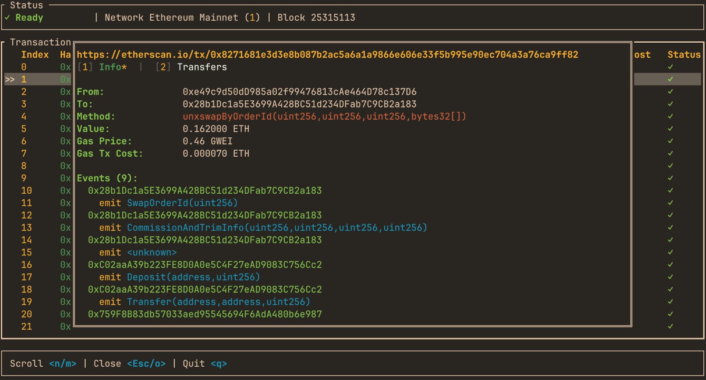

# Quick Start

## Install

mevlog is published on crates.io. Install it
with Cargo:

```bash
cargo install mevlog --locked
```

## Run your first command

_On the first execution of `mevlog` command a signatures DB has to be downloaded and indexed, but it should take max ~1min_.

Fetch and display the transactions in the latest Ethereum mainnet block:

```bash
mevlog block-txs -b latest --chain-id=1
```

It should produce a similar JSON output:

```json
  // ...
      "display_gas_price": "0.16 gwei",
      "tx_cost": "3437206778184",
      "display_tx_cost": "0.000003 ETH",
      "display_tx_cost_usd": "$0.01"
    }
  ],
  "result_count": 156,
  "cached_blocks": 0,
  "new_blocks": 1,
  "duration": "1.49 s",
  "chain": {
    "chain_id": 1,
    "name": "Ethereum Mainnet",
    "currency": "ETH",
    "explorer_url": "https://etherscan.io",
    "native_token_price": 1674.61477
  },
  // ...
```

What just happened? You queried a Mainnet blockchain with ZERO config. Under the hood `mevlog` detects the fastest RPC endpoint from [ChainList](https://chainlist.org/) and uses it to download data.

The first execution against a target block might take a few seconds. But later ALL the data is cached in a local SQLite database (located in `~/.mevlog/`) so subsequent queries against the same block ranges are almost instant!

You can run any SQL query against the local database using the `query` command:

```bash
# Find the most expensive TX in the given blocks range
mevlog query \
  -b 25314888:25314988 \
  --chain-id=1 \
  --sql "
    SELECT
      tx_hash,
      format_ether(u256_mul(gas_used, effective_gas_price)) AS cost
    FROM transactions
    ORDER BY u256_mul(gas_used, effective_gas_price) DESC
    LIMIT 1
  "
```

Produces:
```json
"result": [
  {
    "tx_hash": "0x6bd55342c59905fe4c8a25f43737f60c54d43334cc54472d08f4d0069748ce9a",
    "cost": "0.044113 ETH"
  }
],
```

See [SQL demo](/search) to see database structure, available SQLite helper methods, and run queries against the last week's of Mainnet data.

## mevlog TUI interface

`mevlog` comes with a full blown chains explorer TUI interface. Install it by running:

```bash
cargo install mevlog --features=tui --locked
```

and run:

```bash
mevlog tui
```

It allows exploring over 2k different EVM chains directly from your terminal, using the same SQLite as data storage.


